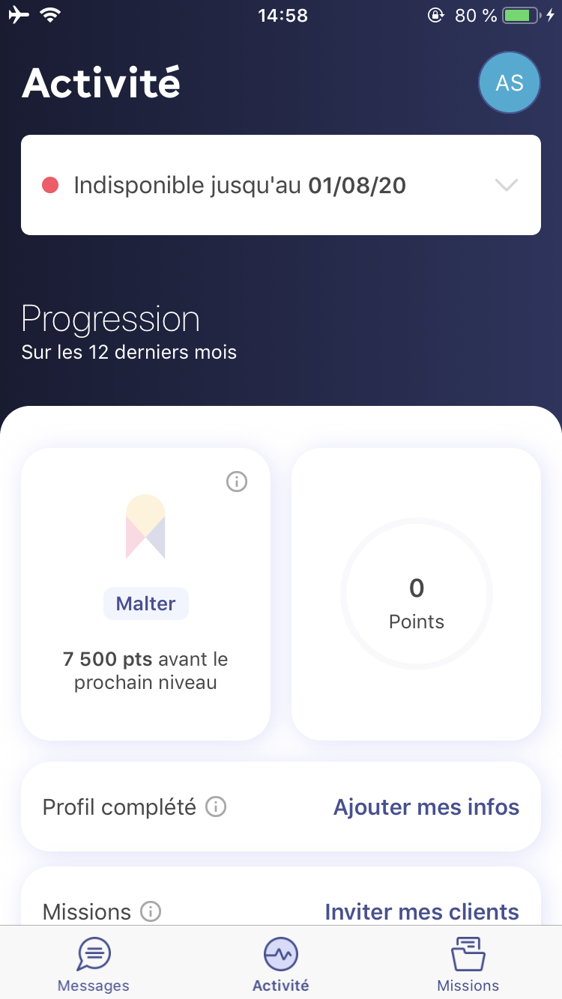
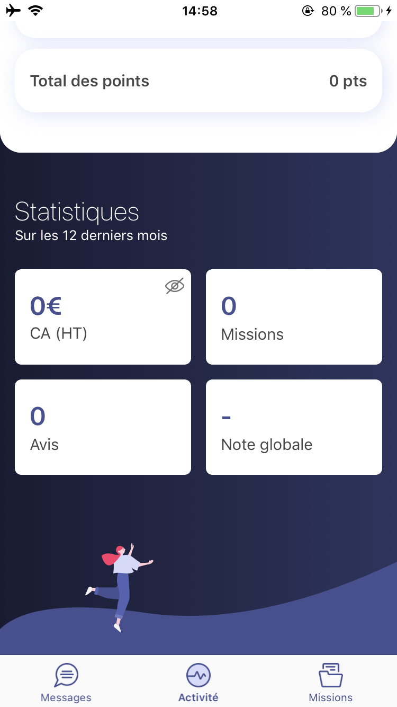
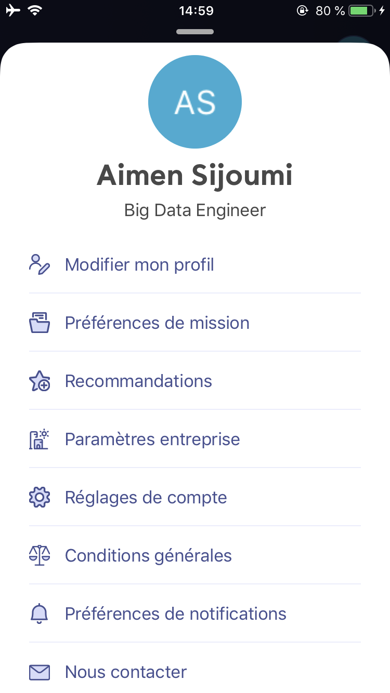
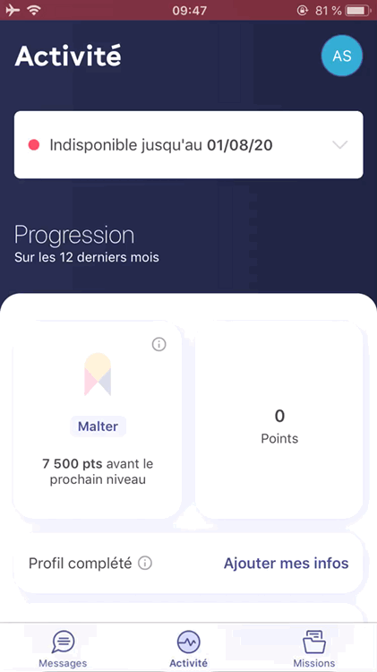
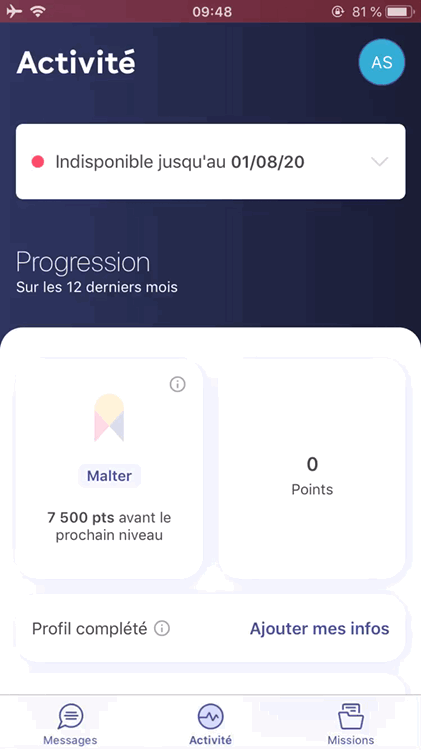
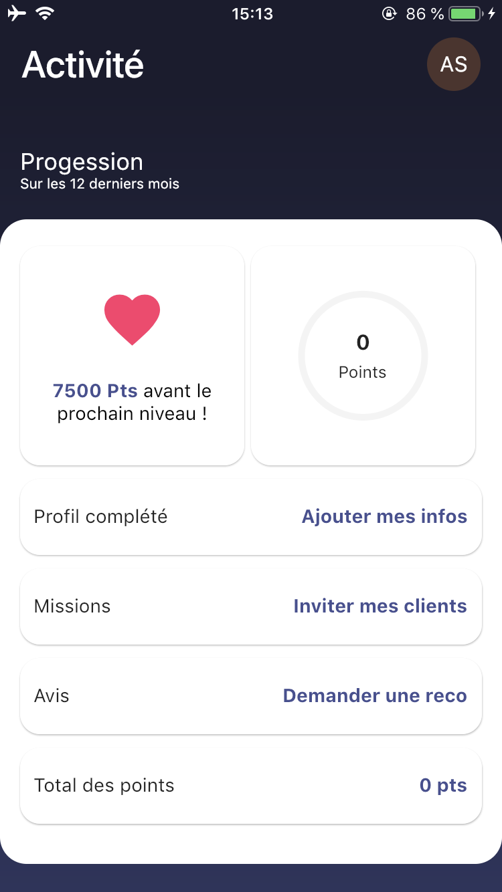
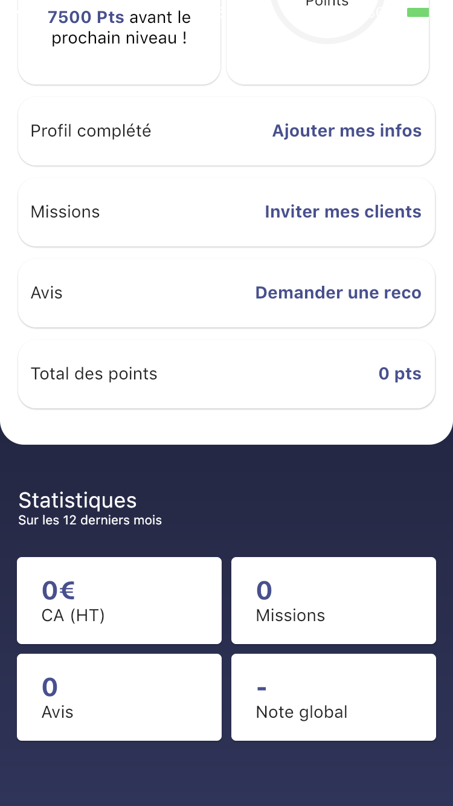
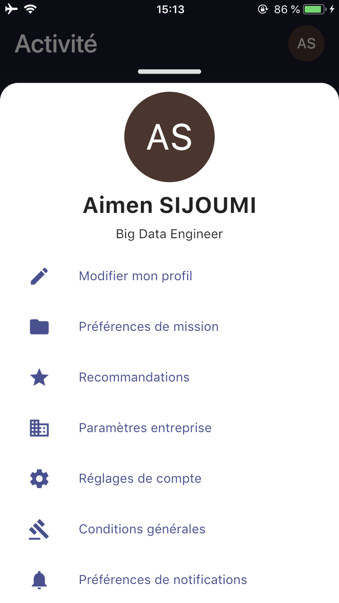
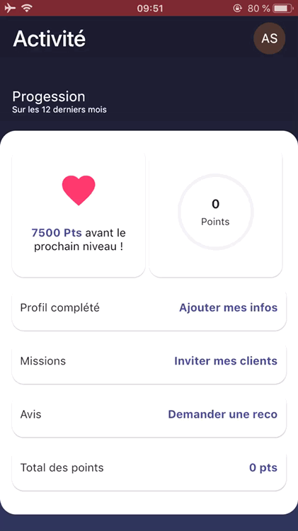
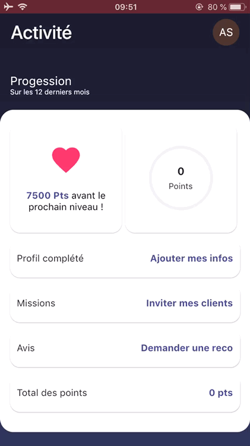

# Malt Flutter Clone

A simple screen of **Malt Freelance** application.

## Original application

Screen 1             |  Screen 2           |  Screen 3
:-------------------------:|:-------------------------:|:-------------------------:
  |    |  

Animation 1             |  Animation 2
:-------------------------:|:-------------------------:
  |  

## The clone application

Screen 1             |  Screen 2           |  Screen 3
:-------------------------:|:-------------------------:|:-------------------------:
  |    |  

Animation 1             |  Animation 2
:-------------------------:|:-------------------------:
  |  

## The Goal

The goal of this clone app is to create with flutter, the same render than native applications. And the all without more dependencies than flutter.

For example, we have the scrollView with the fixed header and a modalView for actions.

All fonts, images and colors are not implementend. The main goals is to reproduce render effect with scrolling (header) and the modal.

## Dependencies

* [Flutter](https://flutter.dev/)

## Getting started

#### 1. [Setup Flutter](https://flutter.dev/docs/get-started/install)

#### 2. Clone the repo

```sh
$ git clone https://github.com/asijoumi/malt_flutter_clone.git
$ cd malt_flutter_clone/
```

#### 3. Run it

## Resources

Multiple resources help me to clone this app :

 - https://flutter.dev/docs/development/ui/advanced/slivers
 - https://stackoverflow.com/questions/55187332/flutter-tabbar-and-sliverappbar-that-hides-when-you-scroll-down
 - https://medium.com/@diegoveloper/flutter-collapsing-toolbar-sliver-app-bar-14b858e87abe
 - https://api.flutter.dev/flutter/material/SliverAppBar-class.html
 - https://api.flutter.dev/flutter/widgets/NestedScrollView/headerSliverBuilder.html
 - https://medium.com/flutter/slivers-demystified-6ff68ab0296f
 - https://api.flutter.dev/flutter/material/CircleAvatar-class.html
 - https://api.flutter.dev/flutter/material/Card/shape.html
 - https://api.flutter.dev/flutter/widgets/Flexible-class.html
 - https://api.flutter.dev/flutter/widgets/RichText-class.html
 - https://stackoverflow.com/questions/56981817/customscrollview-slivers-with-contents-in-sliverfillremaining-not-scrolling
 - https://medium.com/flutterpub/flutter-5-bottom-sheet-2d56bf9f3bc
 - https://medium.com/flutter-community/flutter-beginners-guide-to-using-the-bottom-sheet-b8025573c433
 - https://api.flutter.dev/flutter/widgets/FractionallySizedBox-class.html
- https://stackoverflow.com/questions/53311553/how-to-set-showmodalbottomsheet-to-full-height

## What's Next?
 - [x] Fix the header and scroll
 - [X] Add the modal view
 - [ ] Change the status bar background color when scrolling
 - [ ] Change then *FractionallySizedBox* for bottom sheet modal to *DraggableScrollableSheet*
 - [ ] Implement the refrech indicator (not in this pages)